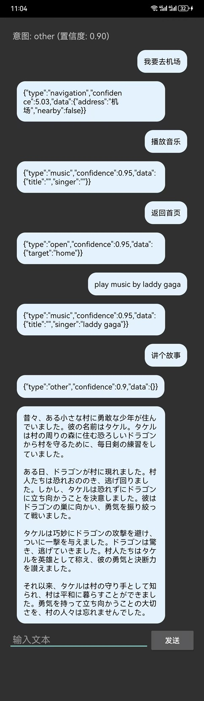
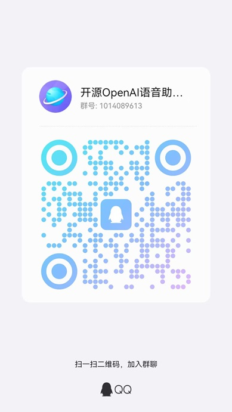

#12-28更新
1、修复英文what's the weather like today意图识别错误
2、修复英文second意图data显示为数字
3、修复回复保持与用户语言一致（英文或日文）

#2024-12-22更新
1、修复以下意图错误：
浜崎あゆみの曲が流れます
マイケルジャクソンの歌が聞きたいです
お話を聞かせてくれます
今日の東京のニュ-スは何ですか
播放周杰伦的稻香
放音乐
2、充分验证音乐、导航、天气、电话、打开等意图，基本验证order\close\exit意图
3、优化大模型回复内容，提升用户友好

#2024-12-20更新
充分验证音乐、导航、天气、电话、打开等意图，基本验证order\close\exit意图

#2024-12-17更新
新增close意图

#2024-12-16更新
重新训练日语意图模型
优化大模型回复与用户语言保持一致
优化打开多个应用键值由1和2改为first和second
优化order意图第几条回复为1、2、3等

#2024-12-13更新
更新电话号码提取
更新打开两个应用时候分屏模式

#2024-12-12更新
完成全部意图识别，包括导航、天气、音乐、电话、打开、关闭、退出、order等

#2024-12-10更新
优化英语意图内容提取，特别是打开/open的处理


# 概述
AGPting SDK 文字版提供了一个完整的AI助手解决方案，包含意图识别、对话管理和特定功能处理等功能。本文档将详细介绍 SDK 的使用方法和主要组件。
## 快速开始
### 1. 初始化
```js
// 创建 VoiceAssist 实例
VoiceAssist voiceAssist = new VoiceAssist(context);

// 设置回调
voiceAssist.setCallback(new VoiceAssist.VoiceAssistCallback() {
    // 实现回调方法...
});

// 初始化组件
voiceAssist.initializeComponents();
```
### 2. 处理用户输入
```java
// 发送用户输入到AI助手
voiceAssist.handleUserInput(userText);
```
### 3. 接收输出文本
通过实现 `VoiceAssistCallback` 接口中的 `onResult` 方法来接收助手的输出文本。

```js
@Override
public void onResult(String result) {
    // 显示或处理助手的响应文本
    System.out.println("助手响应: " + result);
}
```

## 核心组件
VoiceAssist
主要控制器，协调各组件工作。
### 主要方法
```js
    public class VoiceAssist {
    // 构造函数
    public VoiceAssist(Context context)
    
    // 初始化组件
    public boolean initializeComponents()
    
    // 设置回调
    public void setCallback(VoiceAssistCallback callback)
    
    // 处理用户输入
    public void handleUserInput(String text)
    
    // 设置当前位置
    public void setCurrentLocation(String location)
    
    // 获取设备ID
    public String getDeviceId()
}
``` 
#### 回调接口
```java
public interface VoiceAssistCallback {
    void onStateChanged(SpeechState newState);      // 状态变化
    void onSpeechRecognized(String text);          // 识别结果
    void onChatCompleted(String response);         // 对话完成
    void onSpeechSynthesized();                    // 语音合成完成
    void onDialogueEnded();                        // 对话结束
    void onError(String errorMessage);             // 错误发生
    void onInterrupted();                          // 对话被中断
    void onIntentRecognized(String intent);        // 意图识别结果
    void onResult(String result);                  // 处理结果
}
```
## IntentRecognizer
意图识别组件，负责理解用户意图。
### 支持的意图类型
- navigation: 导航请求
- music: 音乐播放
- phone: 电话拨打
- weather: 天气查询
- open: 应用打开
- exit:退出
- other: 其他对话
#### 返回值格式
predictIntent 方法返回的 JSON 格式如下：

| 意图类型 | 返回格式示例 |
|---------|------------|
| 天气 | {"type":"weather","confidence":0.95,"data":{"time":"2024-03-21 15:00","address":"Beijing,CN"}} |
| 导航 | {"type":"navigation","data":{"address":"机场东"}} |
| 音乐 | {"type":"music","data":{"title":"双截棍","singer":"周杰伦"}} |
| 电话 | {"type":"phone","data":{"name":"tom","number":"10086"}} |
| 打开 | {"type":"open","data":{"target":"camera"}} |
| 退出 | {"type":"exit","data":{}} |
| 其他 | {"type":"other","confidence":0.45,"data":{}} |

```js
{
    "type": "weather",      // 意图类型：weather/navigation/phone/music/other
    "confidence": 0.95,     // 置信度：0.00-1.00
    "data": {              // 根据不同意图类型包含不同的数据
        // 具体字段因意图类型而异
    }
}
```
## ChatAPI
大模型对话管理组件。
### 主要功能
- 对话上下文管理
- 多轮对话支持
- 工具函数集成（导航、搜索等）
- 私密模式支持
# 使用示例 
### 基础使用
```java
public class MainActivity extends AppCompatActivity {
    private VoiceAssist voiceAssist;

    @Override
    protected void onCreate(Bundle savedInstanceState) {
        super.onCreate(savedInstanceState);
        
        // 初始化AI助手
        voiceAssist = new VoiceAssist(this);
        
        // 设置回调
        voiceAssist.setCallback(new VoiceAssist.VoiceAssistCallback() {
            @Override
            public void onResult(String result) {
                // 处理助手响应
                showResponse(result);
            }
            
            @Override
            public void onError(String errorMessage) {
                // 处理错误
                showError(errorMessage);
            }
            
            // 实现其他必要的回调方法...
        });
        
        // 初始化组件
        if (!voiceAssist.initializeComponents()) {
            showError("初始化失败");
            return;
        }
    }
}
```

### 特定意图处理
```java
private void handleIntentResult(String intentResult) {
    try {
        JSONObject json = new JSONObject(intentResult);
        String intent = json.getString("type");
        JSONObject data = json.optJSONObject("data");
        
        switch (intent) {
            case "navigation":
                handleNavigation(data);
                break;
            case "music":
                handleMusic(data);
                break;
            // 处理其他意图...
        }
    } catch (JSONException e) {
        showError("意图处理失败");
    }
}
```

## 注意事项
1. 权限要求
- 网络访问权限
- 位置权限（用于导航功能）
- 存储权限（用于缓存）
- 性能考虑
- 意图识别在本地进行，速度快
- 大模型调用为异步操作，避免阻塞主线程
- 建议实现错误重试机制
3. 最佳实践
- 及时处理和显示错误信息
- 实现所有回调方法
- 在 Activity/Fragment 销毁时释放资源

# 错误处理
- SDK 使用统一的错误回调机制，通过 onError 方法传递错误信息。建议实现适当的错误处理和用户提示。
### 版本历史
v1.0.0: 初始版本
- 文本对话功能
- 意图识别支持
- 特定功能处理

# AndroidAI Assistant SDK Demo

## 联系方式
扫描下方二维码加入技术交流群：


